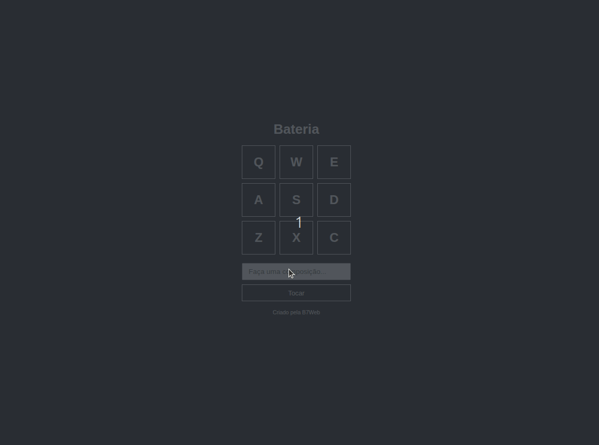

# Bateria Virtual 

Projeto simples de uma bateria virtual (instrumento musical) feito com HTML, CSS e JavaScript.

## 🔧 Tecnologias

- HTML5
- CSS3
- JavaScript

## 💡 Funcionalidades

- Cada botão representa uma peça da bateria (bumbo, caixa, prato, etc.)
- Ao pressionar teclas do teclado, o som correspondente é reproduzido.
- Ao digitar uma sequência de teclas no campo de entrada e em seguida clicar em "Tocar", é tocada uma __batida personalizada__ a partir das teclas digitadas.

## 🖼️ Demonstração



## 🚀 Como executar

1. Clone o repositório:
```bash
git clone https://github.com/seu-usuario/bateria-virtual.git
```

2. Extraia o arquivo e abra o arquivo <code>index.html</code>

## Acesse o site no Github Pages
O projeto está no ar no Github Pages, acesse <a href="https://erica-monteiro-developer.github.io/bateria-virtual/" target="_blank">aqui</a>.
